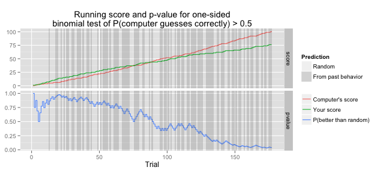
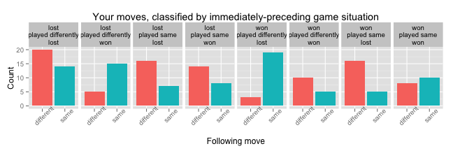

## Claude Shannon

1. Father of Information Theory
1. Also an engineer known for thought-provoking contraptions
    * The Ultimate Machine (only function is to switch itself off)
    * Maze-solving "mouse", 1950 (!)
    * "Mind-reading" machine, 1953
    * Many more

##  Mind-Reading Machine

1. Built to play an old parlor game (guess an adversary's next "random" choice)
1. Limits of hobby tech in 1953: 16 bits of memory!

## But it worked! 

* Or did it? 1953 memorandum doesn't say.

--- 

## Did it work? Let's do it with Shiny and see
* Player chooses "Left" or "Right" _n_ times. Machine guesses what player will play & keeps score of correct guesses. That's it.
* Principle: group successive plays into 8 "situations":
	* `wsw`: player Won, played Same as last time, Won again
	* `wdl`: player Won, played Differently than last time, Lost
	* `...`
* Machine remembers outcome of last 2 of each situations (1 bit: whether player followed up with Same or Different choice). 	If last 2 outcomes are same, expect it again.
* Is this better than chance? We can add some analytics.

## Try it!

* http://rklancer.shinyapps.io/mind-reading
* GitHub: https://github.com/rklancer/mind-reading

---

## Example analysis


```r
history <- readRDS("history.rds")
print(plotOverallScoreAndPvalue(history))
```

 

* App uses statistical test to see if computer's predictions really are better than chance
* Shaded parts show where the simple last-2-situation predictor was used. (No shading = random predictor was used!)
* Player score does seem to kink upwards when last-2-situation predictor is not used.

---

## Hard truths about our ability to be random


```r
print(plotPlaysBySituation(history))
```

 

* When I have won, chosen different, and then lost, I almost always stick with my new choice!
* Anecdotally, paranoia that the machine is "on to you" and has "figured out your plan" seems to be the main driver of these systematic patterns of play.
* Treating it as a party game, with heckling spectators, seems ironically the best way to get the "worst" (most inadvertently predictable) play from users!
* Try it for yourself: http://rklancer.shinyapps.io/mind-reading
